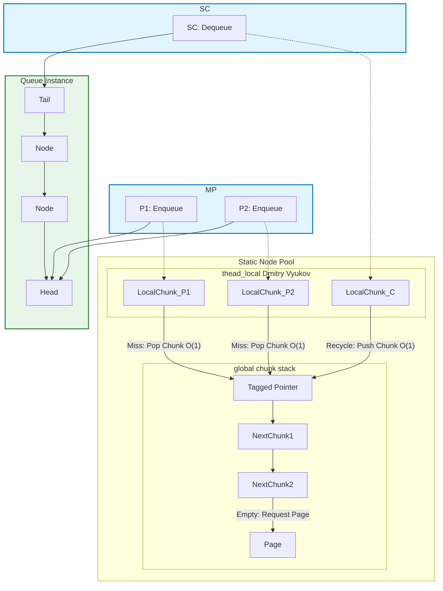

# MPSC_queue

*lockfree boundless high performance MPSC queue*
<br>
*无锁的无界高性能MPSC队列*

## STRUCTURE

## Performance Benchmark

The MPSC queue utilizes a **Thread-Local Node Pool** and a **Wait-Free Global Chunk Stack** to minimize contention and eliminate runtime heap fragmentation.
Actually, heap operations only happend log(N) times, and no matter thread_local or global operations are O(1).

The results below demonstrate throughput (Million Operations per Second) under high concurrency stress.

| Producers (P) | Consumers (C) | Throughput (M Ops/s) | Analysis |
| :---: | :---: | :---: | :--- |
| 1 | 1 | **116.5** | Baseline: Full Thread-Local Cache Hit |
| 2 | 1 | 44.3 | Initial Contention Penalty (Cache Line Thrashing) |
| 4 | 1 | 57.0 | Parallelism Benefits Overcome Contention |
| 8 | 1 | 64.4 | Strong Scaling |
| 16 | 1 | **74.4** | Peak Concurrent Throughput |


## ADVANTAGES:
1. Only log(N) times to lock the global mutex to new nodes, memory allocation overhead is greatly reduced.
2. Fast enqueue and dequeue operations, both are **O(1)** operations.(Dmitry Vyukov)
3. Thread local pool to reduce contention on the global pool.
3. Fast allocation and deallocation of thread_local pool, both are **O(1)** operations by pointer exchange.
4. Relieve pointer chase by allocating nodes in pages.

## DISADVANTAGES:
1. Slightly higher memory usage due to the next_chunk_ pointer in each node.
2. Can't free memory while the program is running, because all nodes have been disrupted and combined freely.
4. Should ensure all producers and consumer threads have ended before main function ends, otherwise will be an UB.
3. ThreadLocalCapacity is fixed at compile time.

## FEATURES:
1. Multiple producers, single consumer.
2. All MPSC_queue instances share a global pool, but the consumer of each MPSC_queue could be different.
3. Customizable ThreadLocalCapacity and Alignment.

## Usage

### MPSC
```C++
// Producers
daking::MPSC_queue<int> queue;
queue.enqueue(1);

// Consumer
int get;
while !(queue.try_dequeue(get)) {
    // do something...
    if (queue.empty_approx()) {
        // The size can't be precisely tracked.
        break;
    }
}
```
**Warning: Ensure all producers and consumer threads have ended before main function ends!**

### Customizable ThreadLocalCapacity and Alignment
```C++
daking::MPSC_queue<int, 1024, 128> queue;
// ThreadLocalCapacity = 1024
// Inner head/tail Alignment = 128
```


### Shared thread_local and global pool
```C++
// All instances with the same template arguments share the same thread_local pool and global pool.

daking::MPSC_queue<int> queue1;
daking::MPSC_queue<int> queue2;

// Thread X: Producer of queue1 and queue2
queue1.enqueue(1);
queue2.enqueue(1);
// The two nodes come from the same thread_local pool of X. 

// Thread A: cosumer of queue1
int a;
queue1.try_dequeue(a);
// Thread B: cosumer of queue2
int b;
queue2.try_dequeue(b);
// They will push chunks to the same global pool.

daking::MPSC_queue<double> queue3;
// queue3 don't share with queue1 and queue2.
```
## Installation

Just need to include `./include/MPSC_queue.hpp` in your project.

## LICENSE:

MPSC_queue is licensed under the [MIT License](./LICENSE.txt).