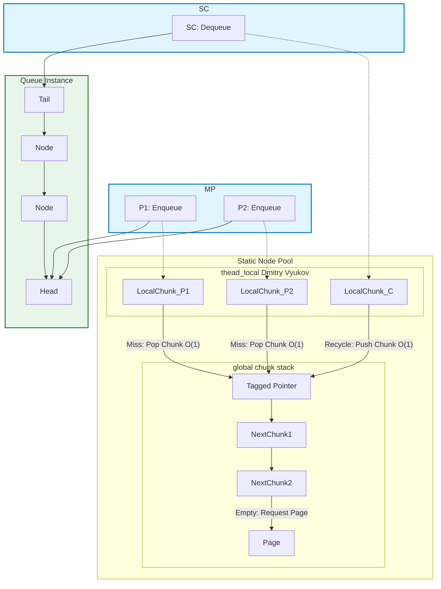

# MPSC_queue

*lockfree unbounded high performance MPSC queue*

*无锁的无界高性能MPSC队列*

[简体中文](./README.zh.md) 

## STRUCTURE

The MPSC queue utilizes a **Thread-Local Node Pool** and a **Lock-Free Global Chunk Stack** to minimize contention.
Actually, heap operations only happend log(N) times, and thread_local or global operations both are O(1).

No matter how much the thread_local pool size is, always O(1) to push or pop it from global chunk stack. (Pool As Chunk)


## Performance Benchmark

The results below demonstrate throughput (Million Operations per Second) under high concurrency stress.

Compiler: **MSVC**
Run on (16 X 3992 MHz CPU s)
CPU Caches:
  L1 Data 32 KiB (x8)
  L1 Instruction 32 KiB (x8)
  L2 Unified 1024 KiB (x8)
  L3 Unified 16384 KiB (x1)
  
| Producers (P) | Consumers (C) | Throughput (M Ops/s) | Analysis |
| :---: | :---: | :---: | :--- |
| 1 | 1 | **154.8** | Baseline: Full Thread-Local Cache Hit |
| 2 | 1 | 45.5 | Initial Contention Penalty (Cache Line Thrashing) |
| 4 | 1 | **61.6** | Peak Concurrent Throughput |
| 8 | 1 | 51.8 | Fall back |
| 16 | 1 | 47.4 | Stabilize |


## ADVANTAGES:
1. Only log(N) times to lock the global mutex to new nodes, memory allocation overhead is greatly reduced.
2. Fast enqueue and dequeue operations, both are **O(1)** operations.(Dmitry Vyukov)
3. Thread local pool to reduce contention on the global resource.
3. The Global Chunk Stack provides fast allocation and deallocation (recycling) to the Thread-Local Node Pool, both achieved as $O(1)$ operations via simple pointer swaps.
4. Relieve pointer chase by allocating nodes in pages.
5. The data field of the node is reused as the next_chunk_ pointer, implying that the two pieces of data are mutually exclusive at any given time.

## DISADVANTAGES:
1. Can't free memory if any instance is alive, because all nodes have been disrupted and combined freely.
2. ThreadLocalCapacity is fixed at compile time.
3. Pointer chase can't be avoided because of list structure.
4. **When the destructor of queue is called: If queue is not empty, the value in left nodes will not be destructed!**(Because only consumer know the the tail pointer)

## FEATURES:
1. Multiple producers, single consumer.
2. All MPSC_queue instances share a global pool, but the consumer of each MPSC_queue could be different. The global pool will be freed by the last instance.
3. Customizable ThreadLocalCapacity and Alignment.
4. The nominal chunk is in fact a freely combined list of nodes.

## Usage

### MPSC
```C++
// Producers
daking::MPSC_queue<int> queue;
queue.enqueue(1);

// Consumer
int get;
while !(queue.try_dequeue(get)) {
    // do something...
    if (queue.empty_approx()) {
        // The size can't be precisely tracked.
        break;
    }
}
```
**WARINGING: When the destructor of queue is called: If queue is not empty, the value in left nodes will not be destructed!**

### Customizable ThreadLocalCapacity and Alignment
```C++
daking::MPSC_queue<int, 1024, 128> queue;
// ThreadLocalCapacity = 1024
// Inner head/tail Alignment = 128
```


### Shared thread_local and global pool
```C++
// All instances with the same template arguments share the same thread_local pool and global pool.

daking::MPSC_queue<int> queue1;
daking::MPSC_queue<int> queue2;

// Thread X: Producer of queue1 and queue2
queue1.enqueue(1);
queue2.enqueue(1);
// The two nodes come from the same thread_local pool of X. 

// Thread A: cosumer of queue1
int a;
queue1.try_dequeue(a);
// Thread B: cosumer of queue2
int b;
queue2.try_dequeue(b);
// They will push chunks to the same global pool.

daking::MPSC_queue<double> queue3;
// queue3 don't share with queue1 and queue2.
```
## Installation

Just need to include `./include/MPSC_queue.hpp` in your project.
For GCC/Clang, you need to link with the atomic library (e.g., by adding -latomic).

## LICENSE

MPSC_queue is licensed under the [MIT License](./LICENSE.txt).