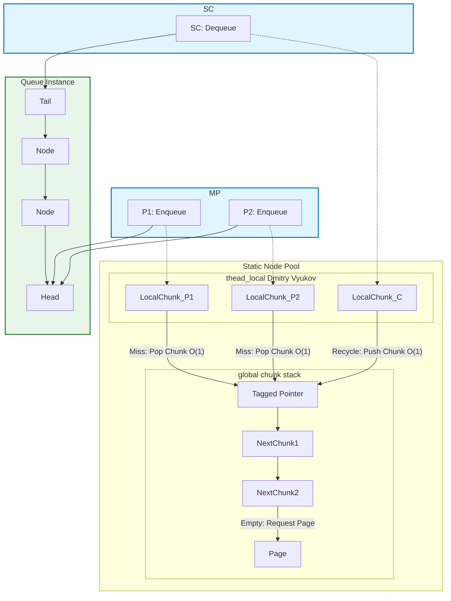

# MPSC_queue

[](https://isocpp.org/)
[](https://opensource.org/licenses/MIT)


​


*lockfree unbounded high performance MPSC queue*

*Lock-free unbounded high-performance MPSC queue*

[简体中文](./README.zh.md) 

## Structural Design

The core design of this queue utilizes a **Thread-Local Node Pool** and a **Lock-Free Global Chunk Stack** to minimize contention.

Regardless of the size of the thread-local pool, chunks are always popped from or pushed to the global chunk stack at $O(1)$ speed. (The local pool is essentially a chunk).

In practice, this queue is not entirely lock-free; lock-based heap operations occur only $\log(N)$ times. Furthermore, the time complexity for both **thread-local** and **global** operations is **$O(1)$**.



Due to the characteristic of utilizing a global chunk stack for O(1) allocation of thread-local queues in units of 'chunks', the thread-local queues for producers and the consumer have a high chance of achieving efficient reuse via the stack in **SPSClike** scenarios.

In scenarios with uniform competition among multiple producers, constrained by the limitations of the linked list structure, continuous `enqueue` operations lead to frequent CAS contention for the head of the list, which touches the performance floor of this queue.

Therefore, the **`daking::MPSC_queue`** is suitable for:

1.  **Scenarios with uneven production and message bursts**, meaning it is suitable for situations where 'producers non-uniformly burst message floods'. This significantly reduces CAS contention in MPSC, quickly pulling the throughput back to a performance level similar to the SPSC scenario.
2.  **Scenarios where producers perform bulk enqueue operations**, i.e., where producers aggregate production or possess a write buffer and perform bulk enqueues. This is because `daking::MPSC_queue::enqueue_bulk` first uses highly efficient thread-local operations to connect the data into a linked list segment, and then performs only one CAS operation to merge this segment of nodes into the queue. 

The performance tests below demonstrate both points.

## Performance Benchmark Analysis

This report presents the complete performance profile of the `daking::MPSC_queue` across various concurrent load scenarios. This queue is designed to achieve maximum performance and resilience in MPSC (Multiple-Producer, Single-Consumer) environments through **Thread-Local Optimization** and **Bulk Atomicity**.

**Reference Queue Note:** This report includes performance data for `moodycamel::ConcurrentQueue` for comparison. Please note that `moodycamel::ConcurrentQueue` is an **MPMC (Multiple-Producer, Multiple-Consumer)** queue and is not specialized for MPSC scenarios.

### 1. Test Environment and Configuration

* **CPU:** Run on (16 X 3992 MHz CPUs)
* **CPU Caches:**
    * L1 Data 32 KiB (x8)
    * L1 Instruction 32 KiB (x8)
    * L2 Unified 1024 KiB (x8)
    * L3 Unified 16384 KiB (x1)

### 2. Detailed Performance Data Tables (Throughput: M int/s)

**Part I: Uniform MPSC Contention (Single-Element Enqueue)**

This scenario tests the throughput when multiple producers write to the queue continuously and uniformly, reflecting the **contention floor** of the linked-list structure.

| Queue | P (Producers) | C (Consumer) | **Throughput (M int/s)** | Notes |
| :--- | :--- | :--- | :--- | :--- |
| **daking** | 1 | 1 | **150.146** | **SPSC Baseline (Fast Path)** |
| daking | 2 | 1 | 46.9628 | |
| daking | 4 | 1 | 58.246 | Peak under uniform contention |
| daking | 8 | 1 | 49.686 | |
| daking | 16 | 1 | 43.1969 | Contention floor |
| **moodycamel** | 1 | 1 | 42.8316 | |
| **moodycamel** | **4** | **1** | **61.1848** | **Best performance in this section (P=4)** |

**Part II: Uneven Sequential Burst (Uneven Wave Aggregation)**

This scenario simulates 4 producers sending messages in a staggered, out-of-phase burst, testing the queue's **performance resilience** under **uneven/sparse load**.
The **Relay Percentage** indicates the percentage of total items written by the current producer when the next producer starts. A higher percentage indicates lower contention.

| Queue | P (Producers) | C (Consumer) | Relay % | **Throughput (M int/s)** | Improvement over Stable 4P |
| :--- | :--- | :--- | :--- | :--- | :--- |
| **daking** | 4 | 1 | $50.0\%$ | $59.9869$ | $+2.99\%$ |
| daking | 4 | 1 | $80.0\%$ | $76.344$ | $+31.07\%$ |
| daking | 4 | 1 | $90.0\%$ | $85.9909$ | $+47.63\%$ |
| daking | 4 | 1 | $95.0\%$ | $118.98$ | $+104.28\%$ |
| daking | 4 | 1 | **$98.0\%$** | **$137.092$** | **$+135.35\%$** (Near SPSC limit) |
| **moodycamel** | 4 | 1 | $50.0\%$ | **50.9436** | - |
| **moodycamel** | 4 | 1 | $98.0\%$ | $45.2742$ | **No significant elastic recovery** |

**Part III: Bulk Enqueue Operation**

This scenario tests the throughput when producers use the `enqueue_bulk` interface, verifying its ability to overcome the saturation contention bottleneck.

| Queue | P (Producers) | C (Consumer) | **Throughput (M int/s)** | Improvement over Single-Element MPSC | Mechanism Verification |
| :--- | :--- | :--- | :--- | :--- | :--- |
| **daking** | 1 | 1 | **238.703** | $+45.7\%$ (vs. 1P Single) | |
| daking | 2 | 1 | 165.611 | $+252.6\%$ (vs. 2P Single) | |
| daking | 4 | 1 | 168.673 | $+189.6\%$ (vs. 4P Single) | **Contention Breakthrough** |
| daking | 8 | 1 | 165.723 | $+233.5\%$ (vs. 8P Single) | |
| daking | 16 | 1 | **161.448** | $+273.7\%$ (vs. 16P Single) | **Sustained high throughput under saturation** |
| **moodycamel** | **2** | **1** | **68.9161** | **Best performance in this section (P=2)** | |
| moodycamel | 16 | 1 | 43.4848 | No bulk advantage at 16P |

### 3. Conclusion

1.  **Elastic Recovery: Performance Guarantee under Uneven Load**
    * **Data Point:** Under sparse load ($\text{98\%}$ relay), **daking** throughput skyrockets from $\sim 58 \text{ M/s}$ to **$\sim 137 \text{ M/s}$**.
    * **Conclusion:** The **Thread-Local Optimization** of `daking::MPSC_queue` provides a significant advantage under uneven loads, enabling **elastic performance recovery** and guaranteeing low latency.

2.  **Bulk Atomicity Breakthrough**
    * **Data Point:** Under $\text{P}=16$ saturated contention, **daking** bulk operation performance reaches **$\sim 161 \text{ M/s}$**, nearly 4 times the single-element throughput.
    * **Conclusion:** The **Bulk Atomicity** mechanism  (single CAS submission of a locally built list segment) in `daking::MPSC_queue` largely overcomes the contention bottleneck of linked-list MPSC queues, resulting in outstanding performance.

## Advantages

1.  High throughput during efficient uniform producer batch writes and extremely high throughput during non-uniform producer bursts.
2.  The **global mutex** only needs to be locked $\log(N)$ times to allocate new nodes, greatly reducing memory allocation overhead.
3.  Fast **Enqueue** and **Dequeue** operations, both with **$O(1)$** complexity. (Derived from Dmitry Vyukov).
4.  Utilizing a **thread-local pool** reduces contention for global resources.
5.  The **Global Chunk Stack** enables extremely fast allocation and deallocation of the **thread-local pool**, both implemented as **$O(1)$** operations via pointer swaps.
6.  Allocating nodes in units of **pages** helps to mitigate pointer chasing.

## Disadvantages

1.  Memory **cannot be freed** if any `MPSC_queue` instance is still alive, as all nodes have been freely shuffled and combined.
2.  `ThreadLocalCapacity` (thread-local capacity) is fixed at **compile time**.
3.  Pointer chasing cannot be avoided because it is a pure linked-list structure.
4.  **WARNING: If the queue is destructed while nodes remain inside, the destructors of the objects stored in those nodes will not be called\!** (This is because only the consumer knows the tail pointer of the queue).

## Features

1.  Multiple-Producer, Single-Consumer (MPSC). The closer the contention scenario is to SPSC, the closer the throughput gets to the SPSC benchmark performance.
2.  All `MPSC_queue` instances with the **same template parameters** share the **global pool**, but each `MPSC_queue` can have a different consumer. The global pool is released by the last surviving instance.
3.  Customizable `ThreadLocalCapacity` (thread-local capacity) and `Alignment`.
4.  The nominal `chunk` is actually a free combination of linked-list nodes.
5.  Reuses the node's data field as a `next_chunk` pointer; these two pieces of data are clearly mutually exclusive at any given time.

## Usage

### MPSC Queue Operations

```c++
// Producer
daking::MPSC_queue<int> queue;
queue.enqueue(1);

// Consumer
int get;
// Attempt to dequeue until successful or the queue is empty
while (!queue.try_dequeue(get)) {
    // Handle waiting (e.g., yielding, sleeping, or C++20 wait/notify)...
    if (queue.empty()) {
        // The queue size cannot be precisely tracked internally. 
        // If necessary, use an external atomic variable for tracking.
        break;
    }
}

std::vector<int> input{1, 2, 3};
queue.enqueue_bulk(input.begin(), 3);
// enqueue_bulk performs multiple thread_local operations but only one CAS operation, resulting in much faster speed.
// enqueue_bulk(it, n): Enqueues elements from an iterator; enqueue_bulk(value, n): Enqueues the value n times. 

int max_fetch = 3;
std::vector<int> output;
// try_dequeue_bulk is likely intended here, but using 'results' from previous context for consistency with the prompt.
size_t count = queue.try_dequeue_bulk(std::back_inserter(output), max_fetch);
// Returns the number of successfully dequeued elements (not exceeding max_fetch).
// Supports both Forward Iterators (e.g., output.begin()) and Output Iterators (e.g., back_inserter).

```

Additional Note on C++20 Features:
If C++20 or later is used, the 'dequeue' and 'dequeue_bulk' methods provide blocking wait functionality. 
However, using these blocking methods may lead to performance degradation when the load state resembles SPSC-like behavior.

**Warning: If the queue is destructed while there are still nodes inside, the destructors for the objects stored in those nodes cannot be called\!**

### Customizable Template Parameters and Memory Operations

```c++
daking::MPSC_queue<int, 1024, 128> queue;
// ThreadLocalCapacity = 1024 (Capacity of the thread-local node pool)
// Internal head/tail Alignment = 128 (Alignment for the internal head/tail pointers)

daking::MPSC_queue<int, 512>::reserve_global_chunk(5);
// Allocates five chunks into the global pool, which amounts to 5 * 512 nodes. 
// No allocation will occur if the parameter is less than the number of chunks already in the global pool.

std::cout << daking::MPSC_queue<int, 512>::global_node_size_apprx();
// Retrieves the approximate total number of global nodes (number of chunks * ThreadLocalCapacity).

daking::MPSC_queue<int, 1024, 128> queue(5);
// Calls daking::MPSC_queue<int, 512>::reserve_global_chunk(5) upon construction.
```

### Shared Thread-Local and Global Pools

```c++
// All instances with the same template parameters share the same thread-local pool and global pool.
// 

daking::MPSC_queue<int> queue1;
daking::MPSC_queue<int> queue2;

// Thread X: Producer for queue1 and queue2
queue1.enqueue(1);
queue2.enqueue(1);
// These two nodes will be allocated from Thread X's single thread-local pool.

// Thread A: Consumer for queue1
int a;
queue1.try_dequeue(a);
// Thread B: Consumer for queue2
int b;
queue2.try_dequeue(b);
// They will push memory chunks back into the same global pool.

daking::MPSC_queue<double> queue3;
// queue3 does NOT share resources with queue1 and queue2 because the template parameter (Ty) is different.
```


## Installation

Simply include the `./include/MPSC_queue.hpp` file in your project(requires C++17 or above).
For GCC/Clang, you need to link the atomic library separately.
CMake is also provided to reproduce the BENCHMARK tests and build example use cases.

## License

`MPSC_queue` is licensed under the [MIT License](https://www.google.com/search?q=./LICENSE.txt).
