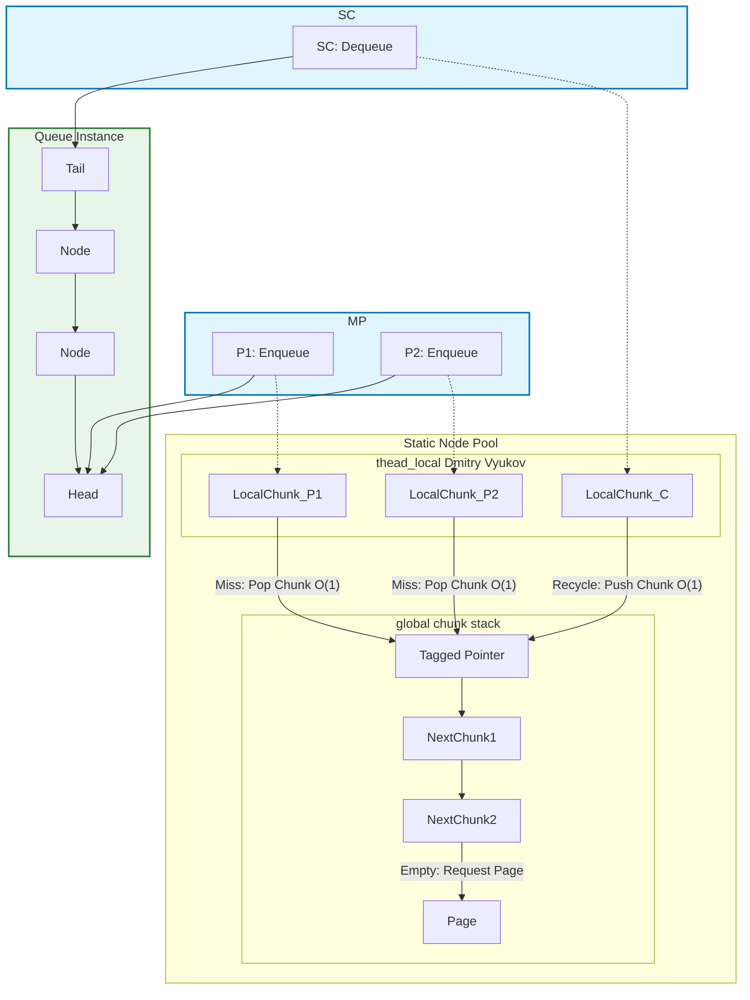

# MPSC_queue

[](https://isocpp.org/)
[](https://opensource.org/licenses/MIT)


​


*lockfree unbounded high performance MPSC queue*

*Lock-free unbounded high-performance MPSC queue*

[English](./README.md) 

## Structural Design

The core design of this queue utilizes a **Thread-Local Node Pool** and a **Lock-Free Global Chunk Stack** to minimize contention.

Regardless of the size of the thread-local pool, chunks are always popped from or pushed to the global chunk stack at $O(1)$ speed. (The local pool is essentially a chunk).

In practice, this queue is not entirely lock-free; lock-based heap operations occur only $\log(N)$ times. Furthermore, the time complexity for both **thread-local** and **global** operations is **$O(1)$**.



Due to the characteristic of using the global chunk stack to allocate thread-local queues in $O(1)$ chunks, in **SPSC-like** scenarios, the thread-local queues of producers and consumers have a high chance of achieving efficient reuse via the stack.

Therefore, `daking::MPSC_queue` is very suitable for **non-uniform production and message burst scenarios**, meaning it excels in situations where "producers non-uniformly burst message floods."
The performance benchmarks section below validates this.

## Benchmarks

Test Environment:
Run on (16 X 3992 MHz CPU s)
CPU Caches:
L1 Data 32 KiB (x8)
L1 Instruction 32 KiB (x8)
L2 Unified 1024 KiB (x8)
L3 Unified 16384 KiB (x1)

### **Part One: Uniform MPSC Contention (Steady Continuous Writes)**

This scenario tests the throughput capacity when multiple producers continuously and uniformly write to the queue.

| Scenario | Producers (P) | Consumers (C) | Throughput (M int/s) | Notes |
| :--- | :--- | :--- | :--- | :--- |
| **SPSC Baseline** | 1 | 1 | **150.146** | Theoretical single-threaded write limit |
| Stable MPSC | 2 | 1 | 46.9628 | Performance degradation due to producer contention |
| Stable MPSC | 4 | 1 | 47.246 | Peak performance for uniform writes |
| Stable MPSC | 8 | 1 | 44.686 | |
| Stable MPSC | 16 | 1 | 43.1969 | Tends to stabilize |

### **Part Two: Non-Uniform Sequential Burst (Uneven Wave Aggregation)**

This scenario simulates $4$ producers sending messages sequentially in a staggered manner (burst traffic).
The peak relay percentage refers to the **percentage of items already written by the current producer when the next producer begins writing, relative to the total number of items produced by each producer.**
As the relay percentage increases, the load gets closer to sequential writing, and contention decreases.

| Peak Relay Percentage (1 - 1/den) | Throughput (M int/s) | Improvement relative to Stable 4P | Design Advantage |
| :--- | :--- | :--- | :--- |
| $50.0\%$ | $59.9869$ | $+27.0\%$ | Intermittent concurrency, slight performance improvement |
| $80.0\%$ | $76.344$ | $+61.6\%$ | Performance improvement when contention is significantly reduced |
| $90.0\%$ | $85.9909$ | $+82.0\%$ | Performance improvement when producers are extremely non-uniform |
| $95.0\%$ | $118.98$ | $+152.6\%$ | **Performance approaches SPSC peak** |
| **$98.0\%$** | **$137.092$** | **$+190.2\%$** | Four nearly independent bursts, almost achieving SPSC efficiency |

### Performance Conclusion

This data strongly demonstrates the unique optimization effect of the `daking::MPSC_queue` architecture:

1.  **Exceptional SPSC Performance:** The base SPSC throughput reaches $150 \text{ M/s}$, setting a high-efficiency foundation for all scenarios.
2.  **Stable Throughput:** In the uniform MPSC write scenario, throughput stabilizes around $45 \text{ M/s}$.
3.  **Astonishing Anti-Burst Capability:** In the non-uniform sequential burst scenario, the queue's throughput **soars from $47 \text{ M/s}$ to $137 \text{ M/s}$**.

## Advantages

1.  High throughput during efficient uniform producer writes and extremely high throughput during non-uniform producer bursts.
2.  The **global mutex** only needs to be locked $\log(N)$ times to allocate new nodes, greatly reducing memory allocation overhead.
3.  Fast **Enqueue** and **Dequeue** operations, both with **$O(1)$** complexity. (Derived from Dmitry Vyukov).
4.  Utilizing a **thread-local pool** reduces contention for global resources.
5.  The **Global Chunk Stack** enables extremely fast allocation and deallocation of the **thread-local pool**, both implemented as **$O(1)$** operations via pointer swaps.
6.  Allocating nodes in units of **pages** helps to mitigate pointer chasing.

## Disadvantages

1.  Memory **cannot be freed** if any `MPSC_queue` instance is still alive, as all nodes have been freely shuffled and combined.
2.  `ThreadLocalCapacity` (thread-local capacity) is fixed at **compile time**.
3.  Pointer chasing cannot be avoided because it is a pure linked-list structure.
4.  **WARNING: If the queue is destructed while nodes remain inside, the destructors of the objects stored in those nodes will not be called\!** (This is because only the consumer knows the tail pointer of the queue).

## Features

1.  Multiple-Producer, Single-Consumer (MPSC). The closer the contention scenario is to SPSC, the closer the throughput gets to the SPSC benchmark performance.
2.  All `MPSC_queue` instances with the **same template parameters** share the **global pool**, but each `MPSC_queue` can have a different consumer. The global pool is released by the last surviving instance.
3.  Customizable `ThreadLocalCapacity` (thread-local capacity) and `Alignment`.
4.  The nominal `chunk` is actually a free combination of linked-list nodes.
5.  Reuses the node's data field as a `next_chunk` pointer; these two pieces of data are clearly mutually exclusive at any given time.

## Usage

### MPSC Queue Operations

```c++
// Producer
daking::MPSC_queue<int> queue;
queue.enqueue(1);

// Consumer
int get;
while !(queue.try_dequeue(get)) {
    // Handle waiting...
    if (queue.empty()) {
        // The queue size cannot be tracked precisely; if you absolutely require it, you can track it externally using an atomic variable.
        break;
    }
}
```
**WARNING: If the queue is destructed while nodes remain inside, the destructors of the objects stored in those nodes will not be called\!**

### Customizable ThreadLocalCapacity and Alignment

```c++
daking::MPSC_queue<int, 1024, 128> queue;
// ThreadLocalCapacity = 1024 (thread-local capacity)
// Inner head/tail Alignment = 128 (Inner head/tail Alignment)
```

### Sharing Thread-Local and Global Pools

```c++
// All instances with the same template parameters share the same thread-local and global pool.

daking::MPSC_queue<int> queue1;
daking::MPSC_queue<int> queue2;

// Thread X: Producer for queue1 and queue2
queue1.enqueue(1);
queue2.enqueue(1);
// These two nodes come from the same thread-local pool of Thread X.

// Thread A: Consumer for queue1
int a;
queue1.try_dequeue(a);
// Thread B: Consumer for queue2
int b;
queue2.try_dequeue(b);
// They will push memory blocks back to the same global pool.

daking::MPSC_queue<double> queue3;
// queue3 does not share resources with queue1 and queue2.
```


## Installation

Simply include the `./include/MPSC_queue.hpp` file in your project.
For GCC/Clang, you need to link the atomic library separately.
CMake is also provided to reproduce the BENCHMARK tests and build example use cases.

## License

`MPSC_queue` is licensed under the [MIT License](https://www.google.com/search?q=./LICENSE.txt).
