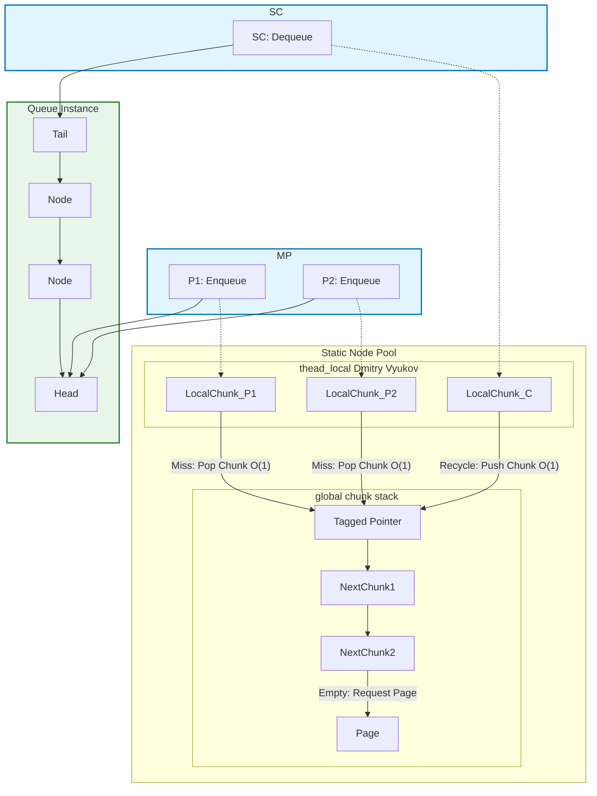

# MPSC_queue

[](https://isocpp.org/)
[](https://opensource.org/licenses/MIT)


​


*lockfree unbounded high performance MPSC queue*

*无锁的无界高性能MPSC队列*

[English](./README.md) 

## 结构设计

该队列的核心设计在于使用**线程本地节点池Thread-Local Node Pool**和**无锁全局块栈Lock-Free Global Chunk Stack**来最小化竞争。

不论线程本地池的大小是多少，总是以O(1)的速度弹出或压入全局块栈。（本地池就是块）

实际上，此队列不是完全无锁的，有锁堆操作仅发生 $\log(N)$ 次，此外无论是**线程本地**还是**全局**操作，时间复杂度都是 **$O(1)$**。




由于利用全局块栈以`chunk`为单位进行O(1)分配线程本地队列的特点，在**SPSClike**场景下生产者和消费者的线程本地队列有很大机会借由栈实现高效复用。

因此，`daking::MPMC_queue`非常适合**非均匀生产和消息突发场景**，也就是适合于“生产者非均匀地爆发洪峰”的场景。
下面的性能基准测试部分证明了这一部分。

## 基准测试

测试环境：
Run on (16 X 3992 MHz CPU s)
CPU Caches:
  L1 Data 32 KiB (x8)
  L1 Instruction 32 KiB (x8)
  L2 Unified 1024 KiB (x8)
  L3 Unified 16384 KiB (x1)

### **第一部分：均匀 MPSC 竞争 (稳定持续写入)**

此场景测试了多个生产者持续、均匀地向队列写入时的吞吐能力。

| 场景 | 生产者 (P) | 消费者 (C) | 吞吐量 (M int/s) | 备注 |
| :--- | :--- | :--- | :--- | :--- |
| **SPSC 基线** | 1 | 1 | **150.146** | 理论单线程写入极限 |
| 稳定 MPSC | 2 | 1 | 46.9628 | 生产者竞争导致性能损耗 |
| 稳定 MPSC | 4 | 1 | 47.246 | 均匀写入的峰值性能 |
| 稳定 MPSC | 8 | 1 | 44.686 | |
| 稳定 MPSC | 16 | 1 | 43.1969 | 趋于稳定 |

### **第二部分：不均匀顺序爆发（Uneven Wave Aggregation）**

此场景模拟了 $4$ 个生产者以接力方式错峰发送消息（突发流量）。
峰值接力百分比指的是**下一个生产者开始写入时当前生产者已写入item数量占每个生产者生产总数的百分比**。
随着接力百分比提高，负载越接近顺序写入，竞争越低。

| 峰值接力百分比 (1 - 1/den) | 吞吐量 (M int/s) | 相较于稳定 4P 的提升 | 设计优势 |
| :--- | :--- | :--- | :--- |
| $50.0\%$ | $59.9869$ | $+27.0\%$ | 间歇性并发，性能略有提升 |
| $80.0\%$ | $76.344$ | $+61.6\%$ | 竞争大幅减少时的性能提升 |
| $90.0\%$ | $85.9909$ | $+82.0\%$ | 生产者极不均匀时的性能提升 |
| $95.0\%$ | $118.98$ | $+152.6\%$ | **性能接近 SPSC 峰值** |
| **$98.0\%$** | **$137.092$** | **$+190.2\%$** | 四次近乎独立的冲击，几乎达到 SPSC 效率 |


### 性能结论

这份数据有力地证明了 `daking::MPSC_queue` 架构的特殊优化效果：

1.  **SPSC 性能卓越：** 基础 SPSC 吞吐量高达 $150 \text{ M/s}$，为所有场景奠定了高效率基础。
2.  **稳定的吞吐量** 在均匀 MPSC 写入场景，吞吐量稳定在$45 \text{ M/s}$ 上下。
3.  **抗冲击能力惊人：** 在不均匀顺序爆发场景中，队列的吞吐量从 $47 \text{ M/s}$ **暴涨至 $137 \text{ M/s}$**。


## 优势

1.  高效的生产者均匀写入时的吞吐量和极高的生产者非均匀爆发时的吞吐量。
2.  仅有 $\log(N)$ 次需要锁定**全局互斥锁global mutex**来分配新节点，极大地减少了内存分配的开销。
3.  快速的 **Enqueue（入队）** 和 **Dequeue（出队）** 操作，两者都是 **$O(1)$** 复杂度。（来自 Dmitry Vyukov）
4.  使用**线程本地池**，减少了对全局资源的竞争。
5.  **全局块栈**对**线程本地池**的分配和释放（deallocation）速度极快，两者都是通过指针交换实现的 **$O(1)$** 操作。
6.  通过以**页pages**为单位分配节点，有助于缓解指针追逐。


## 劣势 (DISADVANTAGES)

1.  如果还有任何MPSC_queue实例存活，则**无法释放内存**，因为所有节点已被自由地打乱和组合。
2.  `ThreadLocalCapacity`（线程本地容量）在**编译时**已固定。
3.  无法避免指针追逐，因为是纯链表结构。
4.  **如果队列被析构时队内还有节点，那这些节点存储的对象的析构函数无法被调用！**（因为只有消费者知道队列的尾指针）

## 特性 (FEATURES)

1.  多生产者，单消费者（MPSC）， 若竞争场景越接近SPSC，吞吐量越接近SPSC基准测试性能。 
2.  所有具有**相同模板参数**的 `MPSC_queue` 实例共享**全局池**，但每个 `MPSC_queue` 的消费者可以是不同的，全局池由最后一个实例释放。
3.  可自定义 `ThreadLocalCapacity`（线程本地容量）和 `Alignment`（对齐方式）。
4.  名义上的`chunk`实际是一段链表节点的自由组合。
5.  复用节点的数据字段作为**next_chunk指针**, 显然这两个数据在同一时间是互斥的。

## 快速上手

### MPSC 队列操作

```c++
// 生产者
daking::MPSC_queue<int> queue;
queue.enqueue(1);

// 消费者
int get;
while !(queue.try_dequeue(get)) {
    // 处理等待...
    if (queue.empty()) {
        // 队列大小无法被精确跟踪，如果你必须需要，可以在外部使用原子变量进行跟踪。
        break;
    }
}
```
**警告：如果队列被析构时队内还有节点，那这些节点存储的对象的析构函数无法被调用！**
### 可定制 ThreadLocalCapacity 和 Alignment

```c++
daking::MPSC_queue<int, 1024, 128> queue;
// ThreadLocalCapacity = 1024 (线程本地容量)
// Internal head/tail Alignment = 128 (内部头尾对齐方式)
```

### 共享线程本地池和全局池

```c++
// 所有具有相同模板参数的实例共享同一个线程本地池和全局池。

daking::MPSC_queue<int> queue1;
daking::MPSC_queue<int> queue2;

// 线程 X：queue1 和 queue2 的生产者
queue1.enqueue(1);
queue2.enqueue(1);
// 这两个节点来自线程 X 的同一个线程本地池。

// 线程 A：queue1 的消费者
int a;
queue1.try_dequeue(a);
// 线程 B：queue2 的消费者
int b;
queue2.try_dequeue(b);
// 它们将把内存块推入同一个全局池。

daking::MPSC_queue<double> queue3;
// queue3 不与 queue1 和 queue2 共享资源。
```


## 安装 (Installation)

只需在您的项目中包含 `./include/MPSC_queue.hpp` 文件即可。
对于GCC/Clang，您需要额外链接atomic库。
也提供CMake复现BENCHMARK测试以及构建example用例。

## 许可证 (LICENSE)

MPSC\_queue 使用 [MIT 许可证](https://www.google.com/search?q=./LICENSE.txt) 授权。