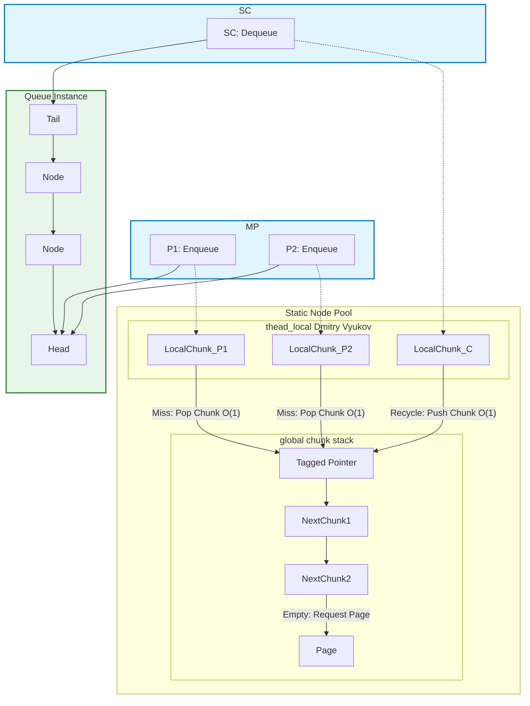

# MPSC_queue

*lockfree boundless high performance MPSC queue*

*无锁的无界高性能MPSC队列*

[English](./README.md) 

## 结构设计

该队列的核心设计在于使用**线程本地节点池Thread-Local Node Pool**和**无等待全局块栈Wait-Free Global Chunk Stack**来最小化竞争。

不论线程本地池的大小是多少，总是以O(1)的速度弹出或压入全局块栈。（本地池就是块）

实际上，堆操作仅发生 $\log(N)$ 次，而无论是**线程本地**还是**全局**操作，时间复杂度都是 **$O(1)$**。




## 性能基准

以下结果展示了在高并发压力下，队列的**吞吐量（Million Operations per Second，百万操作每秒）**。

Compiler: **MSVC**
Run on (16 X 3992 MHz CPU s)
CPU Caches:
  L1 Data 32 KiB (x8)
  L1 Instruction 32 KiB (x8)
  L2 Unified 1024 KiB (x8)
  L3 Unified 16384 KiB (x1)

| 生产者 (P) | 消费者 (C) | 吞吐量 (M Ops/s) | 分析 |
| :---: | :---: | :---: | :--- |
| 1 | 1 | **126.6** | 基准性能：完全命中线程本地缓存 |
| 2 | 1 | 48.6 | 初次竞争开销（Cache Line Thrashing，缓存行颠簸） |
| 4 | 1 | **60.1** | 峰值并发吞吐量 |
| 8 | 1 | 41.5 | 回落 |
| 16 | 1 | 39.1 | 逐渐稳定 |

## 优势

1.  仅有 $\log(N)$ 次需要锁定**全局互斥锁global mutex**来分配新节点，极大地减少了内存分配的开销。
2.  快速的 **Enqueue（入队）** 和 **Dequeue（出队）** 操作，两者都是 **$O(1)$** 复杂度。（来自 Dmitry Vyukov）
3.  通过**线程本地池**设计，减少了对全局池的竞争。
4.  **线程本地池**的分配和释放（deallocation）速度极快，两者都是通过指针交换实现的 **$O(1)$** 操作。
5.  通过以**页pages**为单位分配节点，有助于缓解指针追逐。


## 劣势 (DISADVANTAGES)

1.  由于每个节点额外需要一个 `next_chunk_` 指针，内存使用量略高。
2.  在程序运行期间**无法释放内存**，因为所有节点已被自由地打乱和组合。
3.  **必须确保**在 `main` 函数结束前，所有的生产者和消费者线程都已结束，否则将导致 **UB（Undefined Behavior，未定义行为）**。
4.  `ThreadLocalCapacity`（线程本地容量）在**编译时**已固定。


## 特性 (FEATURES)

1.  多生产者，单消费者（MPSC）。
2.  所有具有**相同模板参数**的 `MPSC_queue` 实例共享**全局池**，但每个 `MPSC_queue` 的消费者可以是不同的。
3.  可自定义 `ThreadLocalCapacity`（线程本地容量）和 `Alignment`（对齐方式）。


## 用法 (Usage)

### MPSC 队列操作

```c++
// 生产者
daking::MPSC_queue<int> queue;
queue.enqueue(1);

// 消费者
int get;
while !(queue.try_dequeue(get)) {
    // 处理等待...
    if (queue.empty_approx()) {
        // 队列大小无法被精确跟踪。
        break;
    }
}
```

**警告：请确保所有生产者和消费者线程在 main 函数结束前都已结束！**

### 可定制 ThreadLocalCapacity 和 Alignment

```c++
daking::MPSC_queue<int, 1024, 128> queue;
// ThreadLocalCapacity = 1024 (线程本地容量)
// Inner head/tail Alignment = 128 (内部头尾对齐方式)
```

### 共享线程本地池和全局池

```c++
// 所有具有相同模板参数的实例共享同一个线程本地池和全局池。

daking::MPSC_queue<int> queue1;
daking::MPSC_queue<int> queue2;

// 线程 X：queue1 和 queue2 的生产者
queue1.enqueue(1);
queue2.enqueue(1);
// 这两个节点来自线程 X 的同一个线程本地池。

// 线程 A：queue1 的消费者
int a;
queue1.try_dequeue(a);
// 线程 B：queue2 的消费者
int b;
queue2.try_dequeue(b);
// 它们将把内存块推入同一个全局池。

daking::MPSC_queue<double> queue3;
// queue3 不与 queue1 和 queue2 共享资源。
```

-----

## 安装 (Installation)

只需在您的项目中包含 `./include/MPSC_queue.hpp` 文件即可。

-----

## 许可证 (LICENSE)

MPSC\_queue 使用 [MIT 许可证](https://www.google.com/search?q=./LICENSE.txt) 授权。