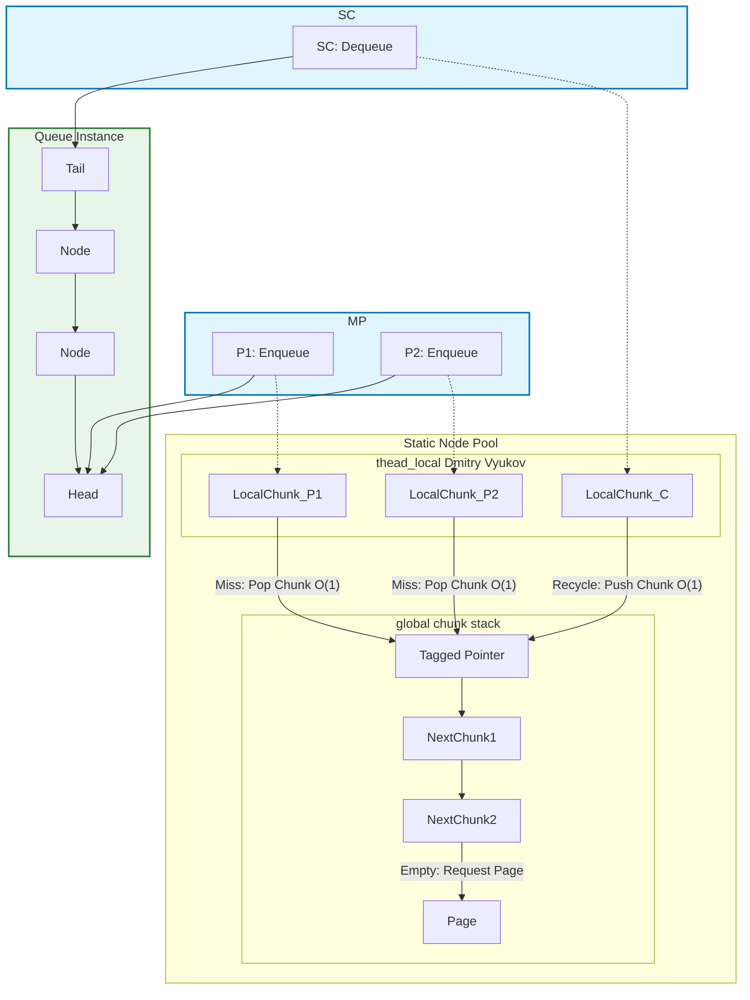

# MPSC_queue

[](https://isocpp.org/)
[](https://opensource.org/licenses/MIT)


​


*lockfree unbounded high performance MPSC queue*

*无锁无界的高性能MPSC队列*

[English](./README.md) 

## 结构设计

该队列的核心设计在于使用**线程本地节点池Thread-Local Node Pool**和**无锁全局块栈Lock-Free Global Chunk Stack**来最小化竞争。

不论线程本地池的大小是多少，总是以O(1)的速度弹出或压入全局块栈。（本地池就是块）

实际上，此队列不是完全无锁的，有锁堆操作仅发生 $\log(N)$ 次，此外无论是**线程本地**还是**全局**操作，时间复杂度都是 **$O(1)$**。




由于利用全局块栈以`chunk`为单位进行O(1)分配线程本地队列的特点，在**SPSClike**场景下生产者和消费者的线程本地队列有很大机会借由栈实现高效复用。
在多生产者均匀竞争的场景下，受限于链表结构的限制，持续的`enqueue`操作会导致对于链表头频繁的CAS竞争，这会触及本队列的性能底线。
因此，`daking::MPSC_queue`适用于：
1. **非均匀生产和消息突发的场景**，也就是适合于“生产者非均匀地爆发洪峰”的场景。
这将极大的降低MPSC的CAS竞争，将吞吐量快速拉回类似SPSC场景的表现。
2. **生产者有批量入队行为的场景**，也就是生产者存在生产的聚合操作或拥有一个写入缓冲区并将批量入队的场景。
这是因为`daking::MPSC_queue:enqueue_bulk`会先使用高效的thread_local操作地把数据连接成一个链表段，然后只发生一次CAS将这段节点合并进队列。
下面的性能测试证明了这两点。

## 性能基准测试

本报告展示了 `daking::MPSC_queue` 在不同并发负载场景下的完整性能表现。本队列旨在通过**线程本地化**和**批量原子化**，在 MPSC 场景中实现性能的极致化和弹性化。

**参照队列说明：** 本报告加入了 `moodycamel::ConcurrentQueue` 的性能数据作为参照对比。请注意，`moodycamel::ConcurrentQueue` 是一个 **MPMC (多生产者、多消费者)** 队列，而非专用的 MPSC 队列。

### 1. 测试环境与配置

Run on(16 X 3992 MHz CPU s)
CPU Caches :
L1 Data 32 KiB(x8)
L1 Instruction 32 KiB(x8)
L2 Unified 1024 KiB(x8)
L3 Unified 16384 KiB(x1)
Compiler: MSVC -O2

### 2. 详细性能数据表 (吞吐量：M int/s)

**第一部分：均匀 MPSC 竞争（单元素写入）**

此场景测试了多个生产者持续、均匀地向队列写入时的吞吐能力，反映了链表结构的**竞争底线**。

| 队列 | P (生产者) | C (消费者) | **吞吐量 (M int/s)** | 备注 |
| :--- | :--- | :--- | :--- | :--- |
| **daking** | 1 | 1 | **150.146** | **SPSC 基线 (Fast Path)** |
| daking | 2 | 1 | 46.9628 | |
| daking | 4 | 1 | 58.246 | 均匀竞争下的峰值 |
| daking | 8 | 1 | 49.686 | |
| daking | 16 | 1 | 43.1969 | 饱和竞争底线 |
| **moodycamel** | 1 | 1 | 42.8316 | |
| **moodycamel** | **4** | **1** | **61.1848** | **本部分最高表现 (P=4)** |

**第二部分：不均匀顺序爆发（Uneven Wave Aggregation）**

此场景模拟 4 个生产者错峰发送消息，测试队列在**非均匀/稀疏负载**下的性能弹性。
**接力百分比**是指下个生产者启动时，当前生产者已完成的写入量。
接力百分比越高，竞争越低。

| 队列 | P (生产者) | C (消费者) | 接力百分比 | **吞吐量 (M int/s)** | 相较于稳定 4P 的提升 |
| :--- | :--- | :--- | :--- | :--- | :--- |
| **daking** | 4 | 1 | $50.0\%$ | $59.9869$ | $+2.99\%$ |
| daking | 4 | 1 | $80.0\%$ | $76.344$ | $+31.07\%$ |
| daking | 4 | 1 | $90.0\%$ | $85.9909$ | $+47.63\%$ |
| daking | 4 | 1 | $95.0\%$ | $118.98$ | $+104.28\%$ |
| daking | 4 | 1 | **$98.0\%$** | **$137.092$** | **$+135.35\%$** (接近 SPSC 极限) |
| **moodycamel** | 4 | 1 | $50.0\%$ | **50.9436** | - |
| **moodycamel** | 4 | 1 | $98.0\%$ | $45.2742$ | **无显著弹性恢复** |

**第三部分：批量入队操作（Bulk Enqueue）**

此场景测试生产者使用 `enqueue_bulk` 批量接口入队时的吞吐量，用以验证其突破饱和竞争瓶颈的能力。

| 队列 | P (生产者) | C (消费者) | **吞吐量 (M int/s)** | 相较于单元素 MPSC 的提升 | 机制验证 |
| :--- | :--- | :--- | :--- | :--- | :--- |
| **daking** | 1 | 1 | **238.703** | $+45.7\%$ (对比 1P 单元素) | |
| daking | 2 | 1 | 165.611 | $+252.6\%$ (对比 2P 单元素) | |
| daking | 4 | 1 | 168.673 | $+189.6\%$ (对比 4P 单元素) | **突破竞争瓶颈** |
| daking | 8 | 1 | 165.723 | $+233.5\%$ (对比 8P 单元素) | |
| daking | 16 | 1 | **161.448** | $+273.7\%$ (对比 16P 单元素) | **饱和竞争下仍保持超高吞吐** |
| **moodycamel** | **2** | **1** | **68.9161** | **本部分最高表现 (P=2)** |
| moodycamel | 16 | 1 | 43.4848 | 16P时无明显批量优势 |

### 3. 结论
1. 弹性恢复：非均匀负载下的性能保证

* 在稀疏负载下（$\text{98\%}$ 接力），吞吐量从 $\sim 58 \text{ M/s}$ 飙升至 **$\sim 137 \text{ M/s}$**。
* **结论：** `daking::MPSC_queue` 的**线程本地化**设计在非均匀负载下具有显著优势，能够实现**性能弹性恢复**，保证低延迟。

2. 批量原子化突破饱和竞争

* 在 $\text{P}=16$ 饱和竞争下，批量操作性能高达 **$\sim 161 \text{ M/s}$**，是单元素入队的近 4 倍。
* **结论：** `daking::MPSC_queue` 的**批量原子化**机制（单次 CAS 提交整个链表段 ）很大程度上突破了链表式 MPSC 队列竞争瓶颈，有显著性能表现。


## 优势

1.  高效的生产者均匀批量写入时的吞吐量和极高的生产者非均匀爆发时的吞吐量。
2.  仅有 $\log(N)$ 次需要锁定**全局互斥锁global mutex**来分配新节点，极大地减少了内存分配的开销。
3.  快速的 **Enqueue（入队）** 和 **Dequeue（出队）** 操作，两者都是 **$O(1)$** 复杂度。（来自 Dmitry Vyukov）
4.  使用**线程本地池**，减少了对全局资源的竞争。
5.  **全局块栈**对**线程本地池**的分配和释放（deallocation）速度极快，两者都是通过指针交换实现的 **$O(1)$** 操作。
6.  通过以**页pages**为单位分配节点，有助于缓解指针追逐。


## 劣势 (DISADVANTAGES)

1.  如果还有任何MPSC_queue实例存活，则**无法释放内存**，因为所有节点已被自由地打乱和组合。
2.  `ThreadLocalCapacity`（线程本地容量）在**编译时**已固定。
3.  无法避免指针追逐，因为是纯链表结构。
4.  **如果队列被析构时队内还有节点，那这些节点存储的对象的析构函数无法被调用！**（因为只有消费者知道队列的尾指针）

## 特性 (FEATURES)

1.  多生产者，单消费者（MPSC）， 若竞争场景越接近SPSC，吞吐量越接近SPSC基准测试性能。 
2.  所有具有**相同模板参数**的 `MPSC_queue` 实例共享**全局池**，但每个 `MPSC_queue` 的消费者可以是不同的，全局池由最后一个实例释放。
3.  可自定义 `ThreadLocalCapacity`（线程本地容量）和 `Alignment`（对齐方式）。
4.  名义上的`chunk`实际是一段链表节点的自由组合。
5.  复用节点的数据字段作为**next_chunk指针**, 显然这两个数据在同一时间是互斥的。

## 快速上手

### MPSC 队列操作

```c++
// 生产者
daking::MPSC_queue<int> queue;
queue.enqueue(1);

// 消费者
int get;
while !(queue.try_dequeue(get)) {
    // 处理等待...
    if (queue.empty()) {
        // 队列大小无法被精确跟踪，如果你必须需要，可以在外部使用原子变量进行跟踪。
        break;
    }
}

std::vector<int> input{1, 2, 3};
queue.enqueue_bulk(input.begin(), 3);
// enqueue_bulk发生多次thread_local操作，只发生一次CAS，速度快的多
// enqueue_bulk(it, n): 从迭代器入队；enqueue_bulk(value, n)：重复value进行n次入队

int max_fetch = 3;
std::vector<int> output;
size_t count = queue.try_dequeue_bulk(std::back_inserter(results), max_fetch);
// 返回成功出队的数量（不超过max_fecth）
// 提供对前向迭代器(如output.begin())和输入迭代器(如back_inserter)的支持
```

如果使用C++20或更高版本，则提供`dequeue/dequeue_bulk`方法进行阻塞等待，但会导致负载状态为SPSClike时的性能下降。

**警告：如果队列被析构时队内还有节点，那么这些节点存储的对象的析构函数无法被调用！**
### 可定制模版参数和内存操作

```c++
daking::MPSC_queue<int, 1024, 128, std::allocator<int>> queue;
// ThreadLocalCapacity = 1024 (线程本地容量)
// Internal head/tail Alignment = 128 (内部头尾对齐方式)
// Allocator = std::allocator<int> (分配器类型)
// Allocator 需要有一个模版构造函数，如 Alloc(const Alloc<U>& other)，以便在不同类型之间转换。
// Allocator::allocate/deallocate 由内部的全局互斥锁保护，因此你不需要确保它们是线程安全的。
// 但是如果定义了 Allocator::construct/destroy 并且它们是有状态的，你需要自己确保线程安全。
daking::MPSC_queue<int, 512>::reserve_global_chunk(5);
// 向全局池分配五个块，也就是5 * 512个节点，如果如果参数小于全局池已有的节点数，则不会分配。
std::cout << daking::MPSC_queue<int, 512>::global_node_size_apprx();
// 查看全局节点（chunk数 * ThreadLocalCapacity）的大概数目。

daking::MPSC_queue<int, 1024, 128> queue(5);
// 在构造之初调用daking::MPSC_queue<int, 512>::reserve_global_chunk(5);
```

### 共享线程本地池和全局池

```c++
// 所有具有相同模板参数的实例共享同一个线程本地池和全局池。

daking::MPSC_queue<int> queue1;
daking::MPSC_queue<int> queue2;

// 线程 X：queue1 和 queue2 的生产者
queue1.enqueue(1);
queue2.enqueue(1);
// 这两个节点来自线程 X 的同一个线程本地池。

// 线程 A：queue1 的消费者
int a;
queue1.try_dequeue(a);
// 线程 B：queue2 的消费者
int b;
queue2.try_dequeue(b);
// 它们将把内存块推入同一个全局池。

daking::MPSC_queue<double> queue3;
// queue3 不与 queue1 和 queue2 共享资源。
```


## 安装 (Installation)

只需在您的项目中包含 `./include/MPSC_queue.hpp` 文件即可（需要C++17或更高版本）。
对于GCC/Clang，您需要额外链接atomic库。
也提供CMake复现BENCHMARK测试以及构建example和test用例。

## 许可证 (LICENSE)

MPSC\_queue 使用 [MIT 许可证](https://www.google.com/search?q=./LICENSE.txt) 授权。